# ServerControlBot
[RU | [EN](README.md)]
Telegram бот для удаленного управления Linux серверами через SSH.

## Текущий функционал

- ✅ Подключение к серверам по SSH
- ✅ Выполнение команд через консоль
- ✅ Сохранение данных серверов
- ✅ Базовое меню управления

## В разработке

- 📊 Мониторинг состояния серверов
- 💎 Выполнение "интерактивных" команд через консоль
- 📁 Управление файлами
- 🔒 Настройки безопасности
- 🔄 Функция перезагрузки

## Предложения по улучшению

Если у вас есть предложения по улучшению бота или добавлению новых функций, пожалуйста, свяжитесь:

- Telegram: [@Rerowros](https://t.me/Rerowros)
- GitHub Issues

## Требования

- Python 3
- Установленные зависимости из requirements.txt
- Настроенный config.json с API данными Telegram

```mermaid
sequenceDiagram
    participant Пользователь
    participant Бот
    participant ФС as Файловая_Система
    participant МенеджерSSH
    participant Сервер

    rect rgb(58, 58, 87)
        Note right of Бот: Инициализация
        Бот->>ФС: Загрузка config.json
        Бот->>ФС: Загрузка servers.json
        Бот->>Бот: Запуск задачи обслуживания
    end

    rect rgb(82, 82, 82)
        Note right of Пользователь: Регистрация сервера
        Пользователь->>Бот: /start
        alt Есть зарегистрированные серверы
            Бот->>Пользователь: Показать меню серверов
        else Нет серверов
            Бот->>Пользователь: Запрос данных сервера
            Пользователь->>Бот: имя:IP:пользователь:пароль
            Бот->>Бот: validate_server_input()
            Бот->>МенеджерSSH: Проверка подключения
            МенеджерSSH->>Сервер: Подключение
            Сервер-->>МенеджерSSH: Подключение успешно
            Бот->>ФС: save_servers()
            Бот->>Пользователь: Показать успех и меню
        end
    end

    rect rgb(82, 52, 52)
        Note right of Пользователь: Режим консоли
        Пользователь->>Бот: Выбор режима консоли
        activate Бот
        Бот->>Пользователь: Режим консоли активирован
        loop До ввода 'exit'
            Пользователь->>Бот: Отправка команды
            Бот->>МенеджерSSH: get_ssh_connection()
            МенеджерSSH->>Сервер: Выполнение команды
            Сервер-->>МенеджерSSH: Вывод команды
            МенеджерSSH-->>Бот: Передача вывода
            Бот->>Пользователь: Отображение результата
            Note over Бот,МенеджерSSH: Обновление last_activity
        end
        deactivate Бот
    end

    rect rgb(56, 56, 24)
        Note right of МенеджерSSH: Управление сессиями
        loop Каждые 60 секунд
            МенеджерSSH->>МенеджерSSH: Проверка таймаутов
            alt Сессия истекла
                МенеджерSSH->>Сервер: Закрытие соединения
                МенеджерSSH->>Бот: Обновление состояния
            end
        end
    end
```

